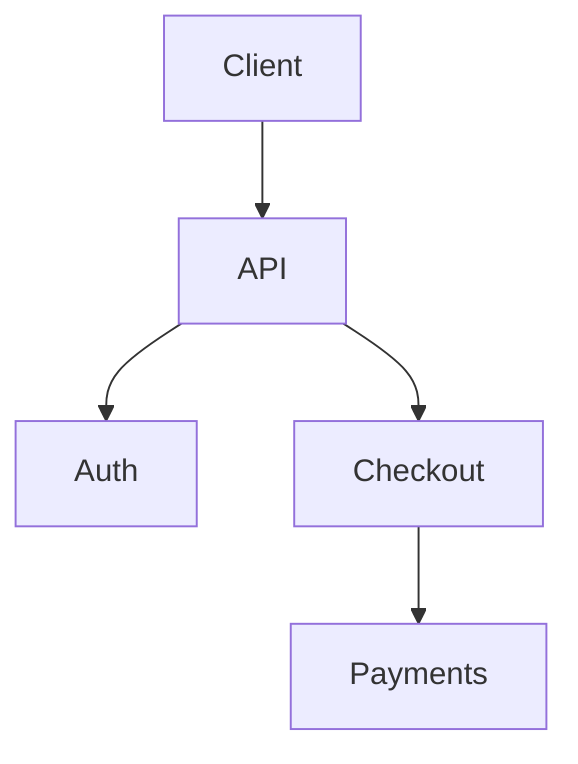
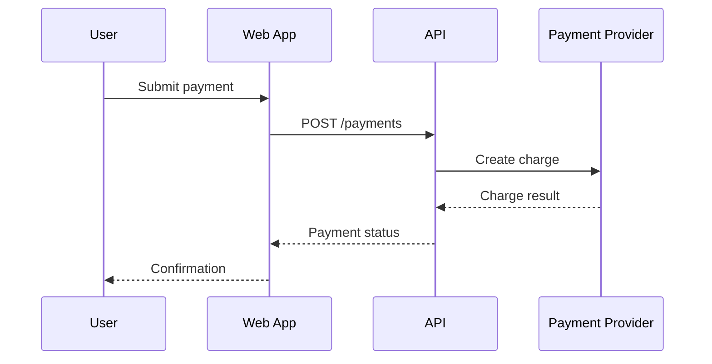

# What’s New in VS Code 1.21x: Native Mermaid Preview, Agent Sessions, and Better Markdown

Date: 2026-05-21
Source: https://www.linkedin.com/posts/the-new-vs-code-release-adds-mermaid-diagram-ugcPost-7462961314181705729-Ebv7?utm_source=social_share_send&utm_medium=ios_app&rcm=ACoAADqTv_wBXXGPo353jX-XXfFlsn3ZQBpJzsY&utm_campaign=share_via
Tags: vscode, markdown, mermaid, ai-agents, observability

## Overview

This VS Code release adds several workflow-focused features that reduce dependence on extensions and make documentation, AI assistance, and remote development feel more integrated. The most immediately useful updates are native Mermaid diagram rendering in Markdown preview, YAML frontmatter displayed as a table, and improvements to the Integrated Browser for HTML preview and selecting multiple page elements into chat context.

For engineers who use VS Code as both an editor and a development cockpit, the more strategic changes are around agent-based workflows: remote agent sessions that keep running over SSH or dev tunnels, model routing for commit messages and titles, and a prebuilt Grafana dashboard backed by OpenTelemetry for agent observability. Together, these features signal a tighter connection between authoring, automation, and operational insight inside the editor.

## Key Concepts

- **Native Mermaid in Markdown preview**: VS Code can now render Mermaid diagrams directly in the built-in Markdown preview. This removes the need for separate preview extensions for common diagram types such as flowcharts and sequence diagrams, making project documentation more portable and consistent across teams.
- **YAML frontmatter visualization**: Markdown files often begin with YAML frontmatter containing metadata like title, tags, authors, or status. Rendering this metadata as a table in preview makes docs easier to inspect visually and helps engineering teams standardize structured documentation without losing readability.
- **Integrated Browser enhancements**: The Integrated Browser now supports HTML file previews and drag-to-select for capturing multiple page elements into chat context. This improves workflows where engineers inspect generated pages, local prototypes, or documentation and want to feed selected content into AI tooling inside VS Code.
- **Remote agent sessions**: The Agents window can run sessions on a remote machine through SSH or dev tunnels, even after the local laptop is closed. This matters for long-running tasks such as code analysis, scaffolding, indexing, or iterative agent-driven changes that should continue independently of the local client.
- **Model routing by task**: VS Code now lets users configure which models handle commit messages and titles. This introduces task-specific model selection, where cheaper or faster models can be assigned to lightweight authoring tasks while stronger models are reserved for more complex coding or reasoning work.
- **Agent observability with OpenTelemetry**: A prebuilt Grafana dashboard for agent observability suggests that agent actions and runtime events can be emitted as OpenTelemetry data. This gives teams visibility into latency, tool calls, failures, and usage patterns, which is essential when AI workflows become part of engineering operations.

## How It Works

This release is best understood as three coordinated improvements inside VS Code: better documentation rendering, richer in-editor web inspection, and more production-like AI agent operations.

First, Markdown preview becomes more capable. With native Mermaid rendering, a Markdown file can contain text and executable-looking diagram definitions in one place, and the preview can display the resulting diagram without external tooling. A typical authoring flow now looks like this:

1. Write Markdown documentation.
2. Embed a Mermaid code block.
3. Open the built-in Markdown preview.
4. See formatted prose, rendered diagrams, and frontmatter metadata in a more structured form.

For example:

```md
---
title: Checkout Service
tags: [architecture, payments]
owner: platform-team
---

# Request flow


```

In this workflow, YAML frontmatter is no longer just hidden metadata. Rendering it as a table makes the preview useful not only for reading the narrative, but also for validating document metadata. That is especially helpful in doc systems, internal RFCs, and static site pipelines where frontmatter drives navigation or publishing.

Second, the Integrated Browser becomes more useful as a local inspection tool. HTML file preview means engineers can open generated or static HTML directly in the editor environment instead of context-switching to an external browser for every iteration. The drag-to-select improvement for multiple page elements into chat context suggests a pipeline like this:

- Open a page or HTML preview in the Integrated Browser.
- Select multiple relevant UI regions or text fragments.
- Send that selected content into the chat/agent context.
- Ask the model to explain layout issues, suggest accessibility fixes, summarize content, or generate code changes.

That closes the loop between artifact inspection and AI-assisted editing. It is particularly useful for front-end work, docs QA, generated reports, and debugging rendered output.

Third, the AI/agent features move beyond simple local chat. Remote agent sessions running via SSH or dev tunnels imply that the actual execution context can live on a remote host, while the editor acts as a control surface. Mechanically, this offers a few advantages:

- The remote machine can have the full repo, dependencies, and credentials needed for a task.
- Long-running jobs can continue after the client disconnects or the laptop is closed.
- The agent can operate closer to the runtime environment, reducing mismatch between local and remote setups.

This makes agent workflows feel more like background jobs or CI-adjacent assistants than transient chat interactions.

Model configuration for commit messages and titles adds another layer of control. Instead of treating all AI actions as equivalent, VS Code is exposing per-task model selection. In practice, that allows teams to optimize for cost, speed, or quality based on the output type. Short commit summarization may not require the same model as code transformation or root-cause analysis.

Finally, observability matters because agent systems are no longer toys once they perform meaningful engineering work. A prebuilt Grafana dashboard backed by OpenTelemetry implies a telemetry flow roughly like this:

1. Agent actions emit traces, spans, logs, or metrics.
2. Telemetry is exported using OpenTelemetry conventions.
3. Grafana dashboards visualize execution characteristics.
4. Engineers can inspect latency, failures, throughput, or model/tool behavior.

That pattern is important because agent-assisted workflows can otherwise become opaque. By treating them like distributed systems components, teams can debug and govern them with familiar operational tools.

## Training Exercise

Build a small documentation workflow in VS Code that uses the new Markdown capabilities and simulates the browser-to-chat loop.

### Goal
Create a Markdown architecture note with frontmatter and a Mermaid diagram, preview it in VS Code, then create a local HTML file to inspect in the Integrated Browser.

### Steps
1. Create a new folder and open it in VS Code.
2. Add a file named `architecture.md` with the following content:

```md
---
title: Payment Processing Overview
status: draft
owner: backend-team
tags: [payments, architecture, docs]
---

# Payment flow

This document describes how a payment request moves through the system.


```

3. Open the Markdown preview and verify two things:
   - The frontmatter is shown in a readable structured form.
   - The Mermaid diagram renders correctly.

4. Add a file named `preview.html`:

```html
<!doctype html>
<html>
  <head>
    <meta charset="utf-8" />
    <title>Demo Page</title>
    <style>
      body { font-family: sans-serif; margin: 2rem; }
      .card { border: 1px solid #ccc; padding: 1rem; margin-bottom: 1rem; }
    </style>
  </head>
  <body>
    <div class="card">
      <h2>Checkout Summary</h2>
      <p>Total: $42.00</p>
    </div>
    <div class="card">
      <h2>Accessibility Notes</h2>
      <p>Button contrast needs review.</p>
    </div>
  </body>
</html>
```

5. Open the HTML file using VS Code’s Integrated Browser or preview support.
6. Select a few content blocks and imagine sending them to chat context. Then manually answer these prompts:
   - Summarize the purpose of the page.
   - Identify one UX issue and one accessibility concern.
   - Suggest one improvement to the HTML structure.

7. Optional advanced step: if you have AI features enabled in VS Code, compare how different configured models perform on generating a commit title for your changes.

### Stretch goal
Add a second Mermaid diagram showing deployment or service dependencies, and keep all project documentation in native Markdown preview without relying on third-party diagram extensions.

## Further Reading

- [VS Code Release Notes](https://code.visualstudio.com/updates)
- [VS Code Markdown and Markdown Preview](https://code.visualstudio.com/Docs/languages/markdown)
- [Mermaid Documentation](https://mermaid.js.org/)
- [OpenTelemetry Documentation](https://opentelemetry.io/docs/)
- [Grafana Documentation](https://grafana.com/docs/)
