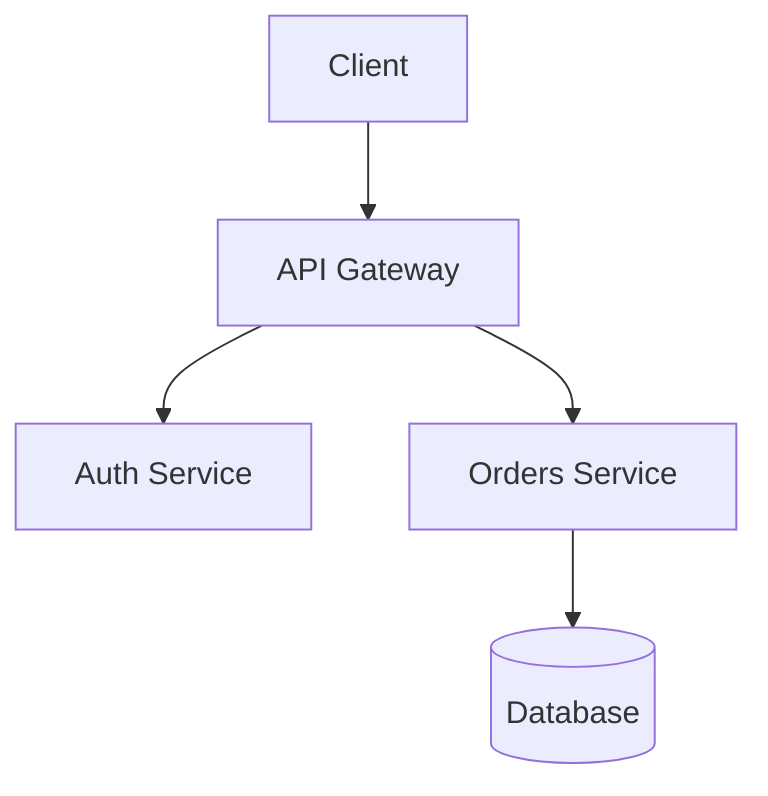
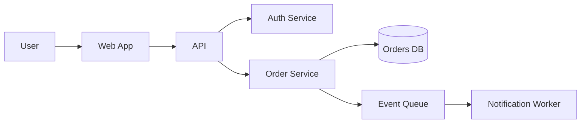
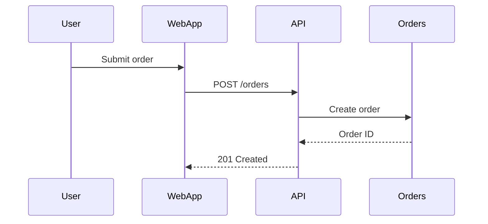

# Using Built-In Mermaid Diagram Support in Visual Studio Code

Date: 2026-06-09
Source: https://www.linkedin.com/posts/mermaid-diagrams-are-now-built-directly-into-ugcPost-7470236547636760576-tAgO/?utm_source=share&utm_medium=member_ios&rcm=ACoAADqTv_wBXXGPo353jX-XXfFlsn3ZQBpJzsY
Tags: vscode, mermaid, diagrams, markdown, documentation

## Overview

Visual Studio Code now includes Mermaid diagram support directly in the editor, removing the need for a separate extension in common documentation workflows. That matters because Mermaid lets engineers define diagrams as text, store them in source control, review them in pull requests, and keep architecture or process documentation close to the code it describes.

This is especially useful for developers, technical writers, platform engineers, and team leads who maintain README files, design docs, runbooks, or system documentation in Markdown. Built-in support lowers setup friction and makes diagram-as-code a more natural part of everyday editing in VS Code.

## Key Concepts

- **Diagram as code**: Mermaid uses a plain-text syntax to describe diagrams such as flowcharts, sequence diagrams, and state diagrams. Because the source is text, it can be versioned, diffed, reviewed, and edited with the same tooling used for code and documentation.
- **Built-in editor support**: When support is built into VS Code, users no longer need to discover, install, and maintain a separate extension just to preview Mermaid content. This reduces onboarding time and avoids extension compatibility or maintenance issues.
- **Markdown integration**: Mermaid is commonly embedded inside fenced code blocks in Markdown documents using the language tag `mermaid`. This allows architecture diagrams and workflow visuals to live directly inside README files, design documents, or wiki-style content.
- **Live preview workflow**: A core benefit of editor integration is the ability to edit diagram source and immediately preview the rendered result. This short feedback loop makes it easier to iterate on structure, labels, and layout without leaving the editor.
- **Docs in source control**: Keeping Mermaid definitions in the repository means diagrams evolve alongside the codebase and can be updated in the same pull request as the implementation. This helps reduce the common problem of architecture diagrams becoming stale.

## How It Works

The core idea is simple: Mermaid turns structured text into diagrams, and VS Code now understands that content natively enough to make the workflow feel first-class. In practice, engineers usually write Mermaid inside Markdown fenced code blocks like this:

```md
# Service Flow


```

With built-in support, the typical editing loop is:

1. Create or open a Markdown file.
2. Add a fenced code block labeled `mermaid`.
3. Write the diagram definition in Mermaid syntax.
4. Open Markdown preview in VS Code to render the diagram.
5. Edit the text until the diagram communicates the intended structure clearly.

This matters because it collapses what used to be a multi-tool process into a single environment. Instead of switching to a separate drawing application, exporting images, and committing binary assets, you define the diagram directly in the document. That improves maintainability and makes documentation changes easier to review in diffs.

A practical way to think about Mermaid support in VS Code is as part of the Markdown rendering pipeline. Markdown provides the document structure, fenced code blocks carry the Mermaid source, and the preview layer renders the diagram for human consumption. The source of truth remains the Mermaid text, not a generated image.

Common use cases include:

- **Architecture diagrams** for services, databases, and external systems
- **Sequence diagrams** for request flows across components
- **State diagrams** for lifecycle-heavy entities
- **Flowcharts** for deployment, approval, or operational processes
- **Onboarding docs** where visual explanation helps new team members understand a system quickly

The biggest engineering advantage is that diagrams become reviewable artifacts. A pull request can show that a new service was added to a flowchart or that an interaction path changed in a sequence diagram. Reviewers can inspect the exact textual change, which is much harder with screenshots or manually drawn diagrams.

There are still some practical considerations. Mermaid syntax is expressive but specific, so correctness depends on writing valid definitions. Teams should also treat diagrams like code: keep them small and focused, split large docs when needed, and update them as part of feature or architecture changes.

## Training Exercise

Create a small Markdown design note in VS Code that uses built-in Mermaid support to document a service flow.

### Goal
Produce a `design.md` file containing a Mermaid diagram and view it in the Markdown preview.

### Steps
1. Open VS Code.
2. Create a new folder for the exercise.
3. Add a file named `design.md`.
4. Paste the following content:

```md
# Order Processing Overview

This document describes the high-level request flow.


```

5. Open the Markdown preview in VS Code.
6. Confirm that the diagram renders without installing an extension.
7. Modify the diagram to add a `Payment Service` between `Order Service` and `Orders DB`.
8. Add a second Mermaid block using a sequence diagram:

```md

```

### What to observe
- How quickly you can iterate by changing text and re-opening preview
- How easy it is to keep diagrams next to explanatory prose
- How the diagram source would appear in a code review

### Stretch task
Commit the file to a Git repository and make one follow-up change to the diagram. Inspect the diff to see how diagram changes are represented in source control.

## Further Reading

- [Mermaid Official Documentation](https://mermaid.js.org/)
- [Visual Studio Code Documentation](https://code.visualstudio.com/docs)
- [Markdown in Visual Studio Code](https://code.visualstudio.com/docs/languages/markdown)
- [Mermaid Syntax Reference](https://mermaid.js.org/intro/syntax-reference.html)
